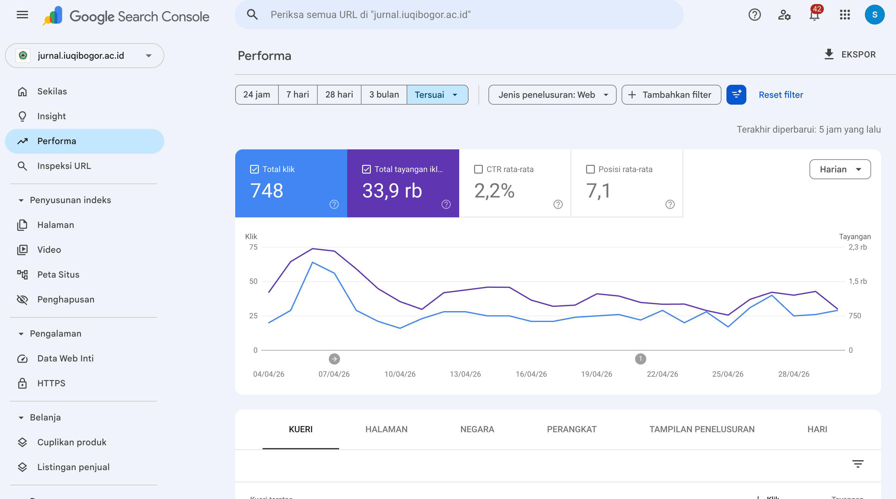
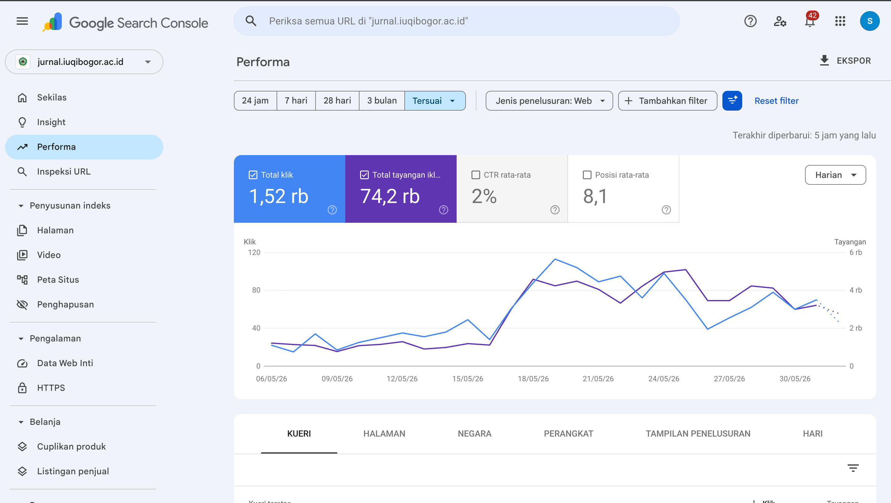

## Ringkasan

Layanan jurnal kampus sering error, dan tidak terindex dengan baik di Google Searh. Impressions melonnjak hingga 200% dari 3 bulan sebelumnya. Data impression bulan januari sampai april 2026 hanya mendapat sekitar 33K IMpression. Setelah saya perbaiki SEO-nya, data impression pada bulan Mei 2026 saja naik menjadi 77K impression.

## Masalah

Sebelum optimasi

Masalahnya di mulai dari Sitemap yang tidak mengenerate semua URL yang ada pada Website Jurnal. Sehingga, crawler sangat terbatas ketika crawling data. 

## Solusi

Saya menyusun ulang SEO dengan mengubah bagian Sitemap. Sehingga, pada sitemap menampilkan semua URL yang dimiliki tiap Jurnal. 

## Hasil

Setelah optimasi

- Kenaikkan impression 200%, menjadi 77K impression dalam waktu 1 bulan.
- Sitemap tiap jurnal menampilkan semua URL.
- Proses Craling oleh Bot Crawler seperti google, bing atau semacamnya lebih terarah.
